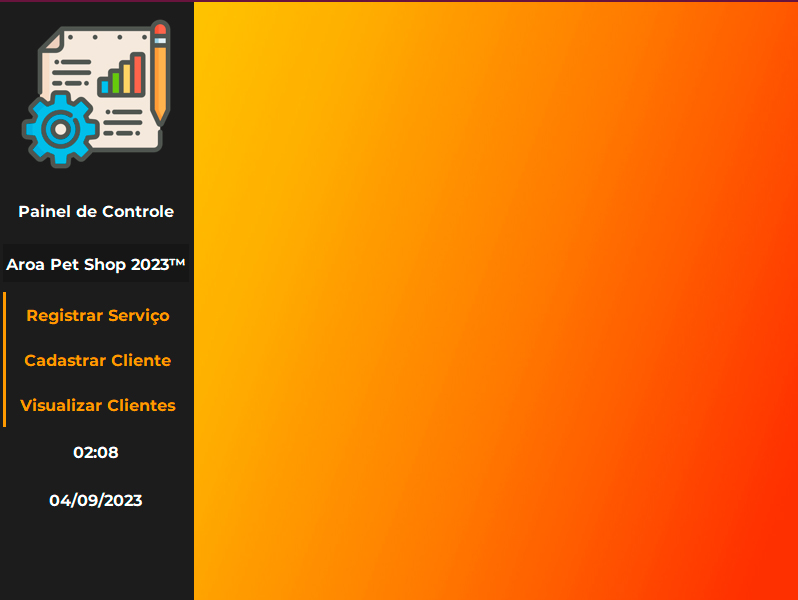

<h1 align="center"> Pet Shop GUI </h1>

Ferramenta Administrativa  

  <a href="#-Tecnologias">Tecnologias</a>&nbsp;&nbsp;&nbsp;|&nbsp;&nbsp;&nbsp;
  <a href="#-Projeto">Projeto</a>&nbsp;&nbsp;&nbsp;|&nbsp;&nbsp;&nbsp;
  <a href="#-Bibliotecas">Bibliotecas</a>&nbsp;&nbsp;&nbsp;|&nbsp;&nbsp;&nbsp;

 

  

## 🚀 Tecnologias

Esse projeto foi desenvolvido com as seguintes tecnologias:

- Python 3
- Git e Github

## 🔖 Bibliotecas

tkinter: Biblioteca padrão do Python para criar interfaces gráficas.

ttk (parte do tkinter): Oferece widgets mais avançados e estilizados, como botões e caixas de seleção, que podem melhorar a aparência da interface gráfica.

messagebox (parte do tkinter): Usada para exibir caixas de diálogo de mensagem para interação com o usuário.

openpyxl: Usada para trabalhar com planilhas do Excel, como a função de abrir e manipular arquivos do Excel.

os: Biblioteca padrão para operações relacionadas ao sistema operacional, como manipulação de arquivos e diretórios.

PIL (Pillow): Usada para abrir, manipular e exibir imagens em vários formatos, como JPEG, PNG e outros.

ImageTk (parte do PIL/Pillow): É usada para exibir imagens em interfaces gráficas criadas com o tkinter.

## 💻 Projeto

Este projeto é uma ferramenta administrativa para um pet shop, 
oferecendo funcionalidades como registro de serviços, cadastro 
de clientes e visualização de dados em uma interface gráfica 
amigável. Ele também exibe a hora e a data atual para facilitar
o controle e a organização das atividades diárias.

Feito com ♥ by João Pedro Liberato :wave:
